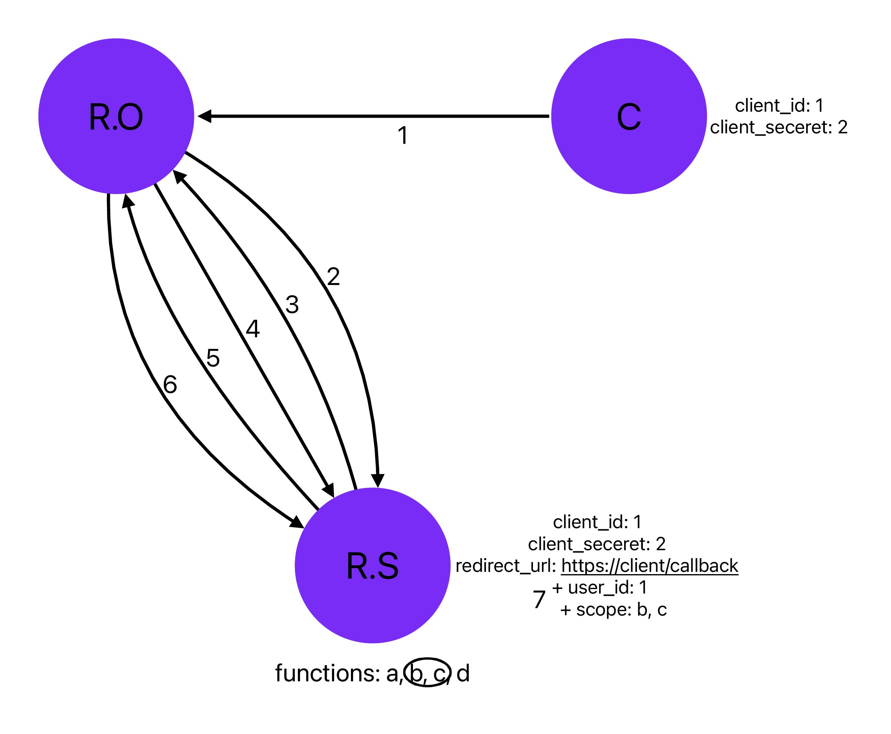

1. R.O가 C를 사용중에, C와 연동된 R.S의 기능을 사용하려고 할 때, C는 R.O에 'Login with Google' 같은 버튼을 보여준다.

2. R.O는 'Login with Google+'에 링크된 'https://resource_server/?client_id=1&scope=b,c&redirect_uri=https://client/callback' 이 주소를 통해서 R.S에 파라미터들과 함께 접속한다. R.S는 이 파라미터들을 임시로 저장한다.

3. R.S는 R.O의 로그인 여부를 확인하고, 로그인 되어있지 않다면, 로그인 링크를 R.O에게 보낸다.

4. R.O는 로그인 한다.

5. R.S는 R.O가 'Login with Google' 버튼을 눌러서 접속할 때 가져온 파라미터 인 client_id, redirect_uri 값들이 자신이 가지고 있는 값들과 같은지 확인한다. 같지 않다면 작업을 중지하고, 같다면 R.S는 R.O에게 당신(R.O)이 자신에게 가진 권한(b,c)을 C가 사용해도 되냐고 묻는 메세지(창)을 R.O에게 보낸다.

6. R.O는 메세지에있는 허용 버튼을 누른다.

7. R.S는 2에서 임시 저장한 파라미터들과 R.O에서 받아온 user_id: 1을 저장한다

