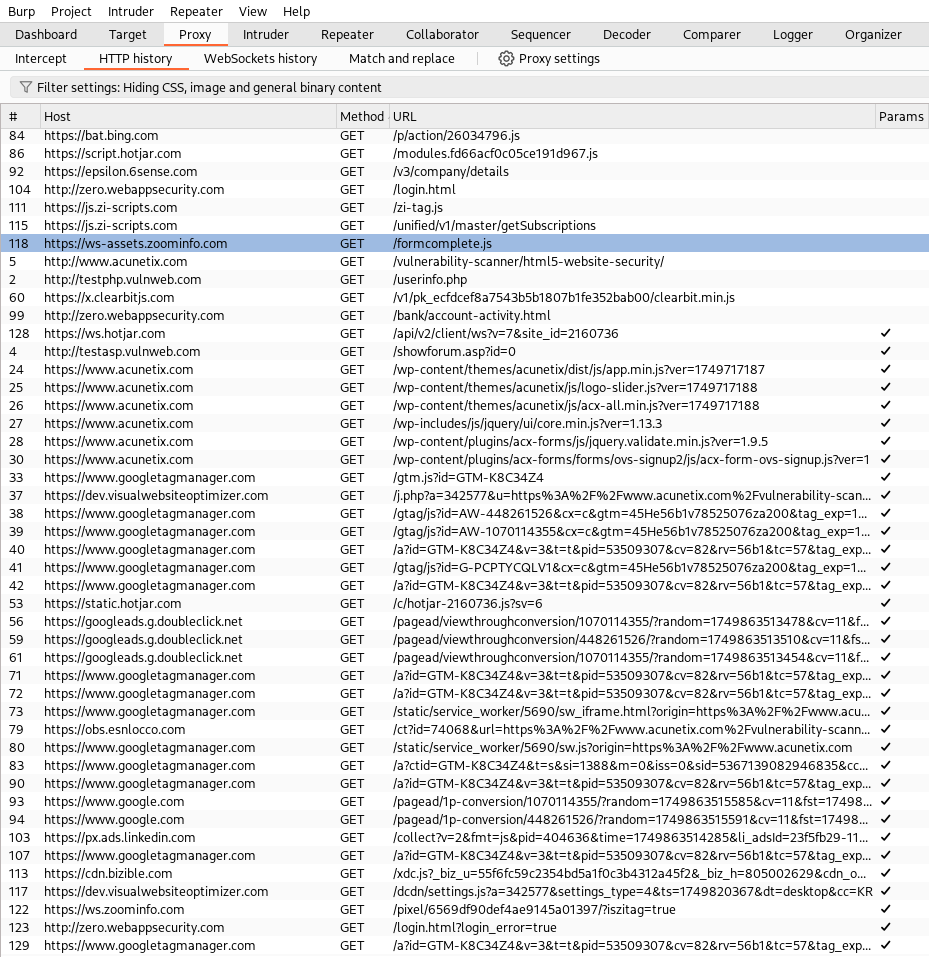
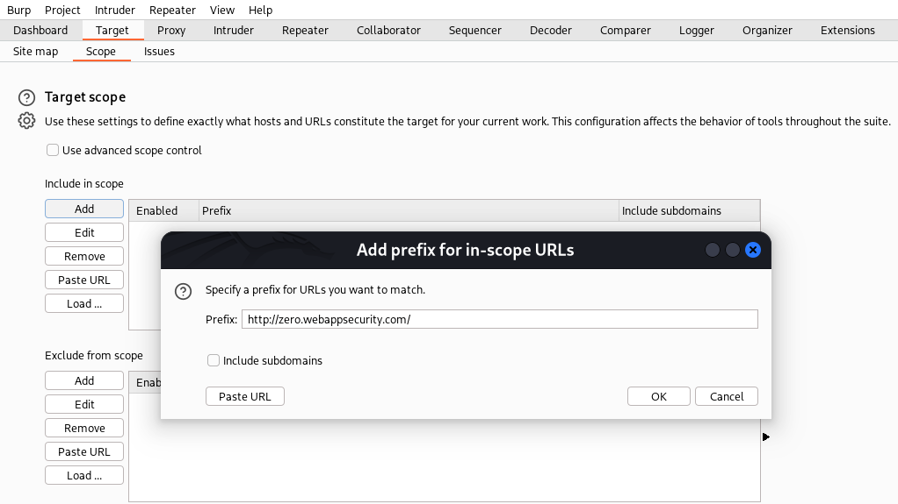
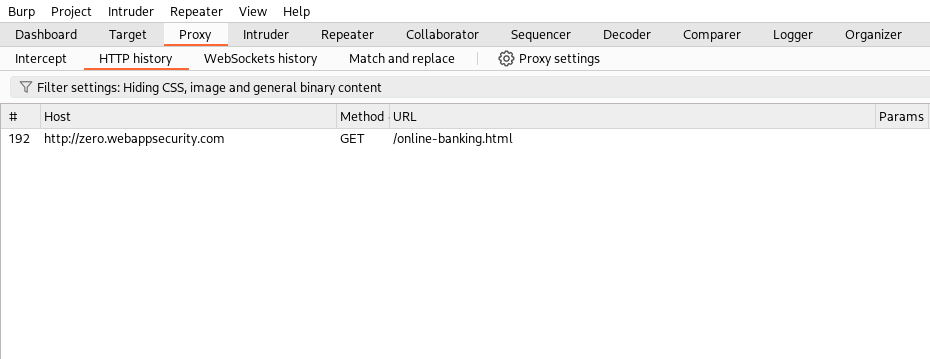

Burp Suite can be overwhelming at first — the endless HTTP requests and complex interface often confuse beginners. I was no exception.

Using scope can be especially helpful if you have multiple tabs open in your browser and still want to browse other websites while targeting a specific one in Burp Suite.

In the above example, you can see there are tons of requests, and you probably don’t want unnecessary ones getting in your way.

If you're visiting multiple websites but only targeting a few, you can define your scope in Burp Suite under the "Target" tab. You can also set the scope by right-clicking on a request and selecting "Add to scope."

Now that you've set the scope in Burp Suite, other webpages are no longer logged in the history. You’re free to Google, use ChatGPT, or browse the web without cluttering your logs

Here is the example.

2. Prioritize requests that include parameters,
3. Neglect informational HTTP responses (status codes 100-199)
