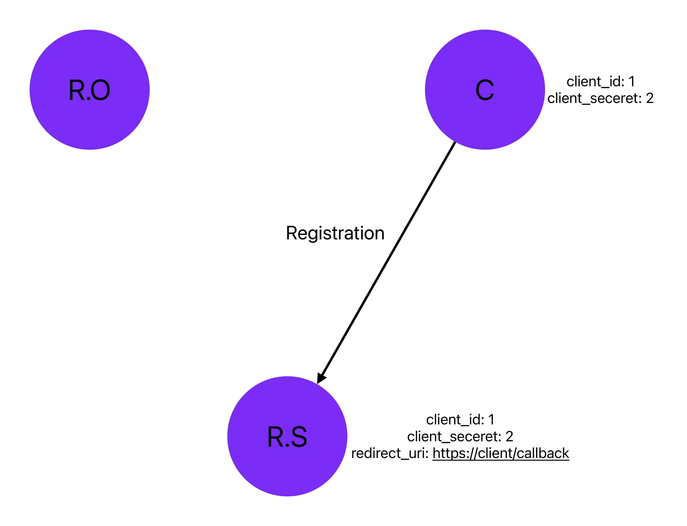

클라이언트(C)가 리소스 서버(R.S)의 기능을 OAuth를 통해 사용하려면, 먼저 리소스 서버에 클라이언트 등록을 해야 합니다.

리소스 서버에 클라이언트 등록하기 위해서 Redirect URI이 필요합니다. Redirect URI은 OAuth 인증 과정에서 사용자가 인증을 완료한 후 **다시 돌아올 주소**입니다.

클라이언트가 리소스 서버에 등록하면 Client ID와 Client Secret을 발급받게 되고, 리소스 서버는 이 정보들을 저장합니다. 즉 클라이언트와 리소스서버는 Client ID와 Client Secret, Redirect URI를 공유하게 됩니다.
